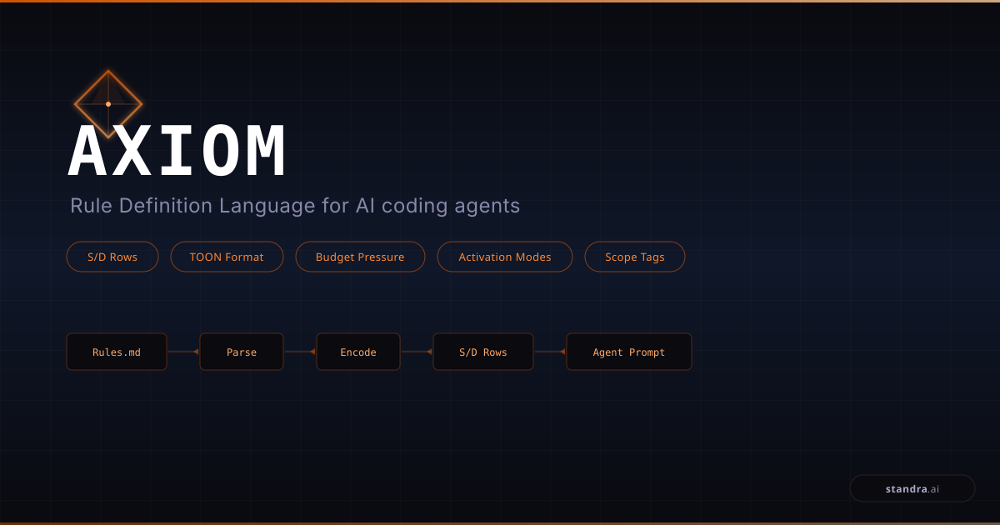

<p align="center">
  
</p>

# Axiom

A compact Rule Definition Language (RDL) for AI coding agents. Compiles verbose markdown rules into self-describing tabular format with 87% token reduction and no compliance degradation.

## Empirical Results

Tested across 20 A/B runs on 8 coding tasks with Claude Sonnet 4.6:

| Metric | Markdown (1195 tok) | Axiom S/D (159 tok) |
|--------|---------------------|---------------------|
| Mean compliance | 91.0% | 90.5% |
| Token savings | -- | 86.7% |
| Wins / Losses / Ties | 5 / 5 / 10 | 5 / 5 / 10 |

**Key finding**: Axiom achieves compliance parity at 87% token reduction. Same compliance, fraction of the cost.

The path to 100%: static format (Axiom, ~91%) + dynamic PostToolUse compliance hook (~9% remaining) = ~100%.

See [paper.md](paper.md) for the full research paper and [bench/](bench/) for the benchmark.

## Before & After

**Markdown rule (87 tokens):**

```markdown
## Git Safety
- Never use `git push --force` on any branch. Force pushing rewrites
  remote history and can destroy other contributors' work. If you need
  to update a remote branch, use `git push --force-with-lease` instead,
  which will fail if the remote has commits you haven't seen.
```

**Axiom compiled (18 tokens):**

```
GOVERNANCE[1]{id,effect,domain,trigger,message}:
no-force-push,forbid,Git,push --force,Use --force-with-lease instead
```

## Format

Axiom uses [TOON](https://toonformat.dev)-style self-describing tabular headers:

```
SECTION_NAME[N]{col1,col2,...}:
value1,value2,value3,...
value1,value2,value3,...
```

- `SECTION_NAME` -- uppercase category (GOVERNANCE, CODING, SECURITY, etc.)
- `[N]` -- row count (optional, derivable from rows)
- `{col1,col2,...}` -- inline column schema
- Rows are CSV-like, one rule per line

## Core Schemas

| Category | Columns |
|----------|---------|
| GOVERNANCE | `id, effect, domain, trigger, condition, message` |
| CODING | `id, language, scope, pattern, effect, fix_hint, severity` |
| SECURITY | `id, risk_level, data_type, trigger, effect, response` |
| TESTING | `id, effect, target, threshold, action, message` |
| WORKFLOW | `id, effect, phase, actor, condition, message` |

## Source Format

Rules are authored as markdown with YAML frontmatter. Axiom's frontmatter is a superset of Claude Code's `description`/`paths`/`when_to_use` fields, so `.claude/rules/*.md` files work with both CC and Axiom without modification.

```markdown
---
id: no-force-push
description: Prevent force-push to protected branches
category: governance
effect: forbid
priority: critical
trigger: push --force
globs: ["*.sh"]
when_to_use: When reviewing or executing git push commands
---
Never use `git push --force`. Use `--force-with-lease` instead.
```

## Pressure Zones

| Zone | Context | Behavior |
|------|---------|----------|
| FRESH | 0-40% | All rules |
| MODERATE | 40-70% | Drop `inform`, drop `message` |
| DEPLETED | 70-90% | Critical + high only |
| CRITICAL | 90%+ | Safety floor (critical + forbid) |

## How to Validate

Run the compliance benchmark yourself:

```bash
# Install dependency
pip install tiktoken

# Dry run (no Claude invocation, validates rules + format generation)
python bench/runner.py --mode dry

# Full A/B comparison (requires Claude CLI, costs money)
python bench/runner.py --mode ab

# Aggregate results from all runs
python bench/aggregate.py
```

See [bench/README.md](bench/README.md) for details.

## Orchestration & Complexity Stratification (v0.6.0)

Axiom §17 standardizes how runners report multi-dimensional dispatch results: orchestration shape vocabulary (`flat` / `waves` / `scatter-gather` / `team-mode` / `subagents`), complexity tier vocabulary (`display` / `crud` / `transactional` / `cross_cutting`), the `fixture_gap` terminal status, `verification_runs[]`, and `artifact_quality`. Inspired by Fabian Wesner's [One-Shot Shop Challenge](https://agentic-engineers.dev) — the empirical demonstration that orchestration architecture beats model choice (Team Mode 85% vs Sub-Agents 57% on the same model). Reference implementation: [pawbench](https://github.com/zenprocess/pawbench). See [spec.md §17](spec.md).

## Documentation

- [Paper](paper.md) -- research paper with empirical results (arXiv-style)
- [Specification](spec.md) -- normative format definition (v0.6.0)
- [Benchmark](bench/) -- compliance benchmark (10 rules, 8 tasks, 20 runs)
- [Compliance Hook](docs/compliance-hook.md) -- PostToolUse hook for ~100% compliance
- [Examples](examples/) -- sample `.axiom` files

## License

[MIT](LICENSE)

---
<p align="center">
  
</p>
